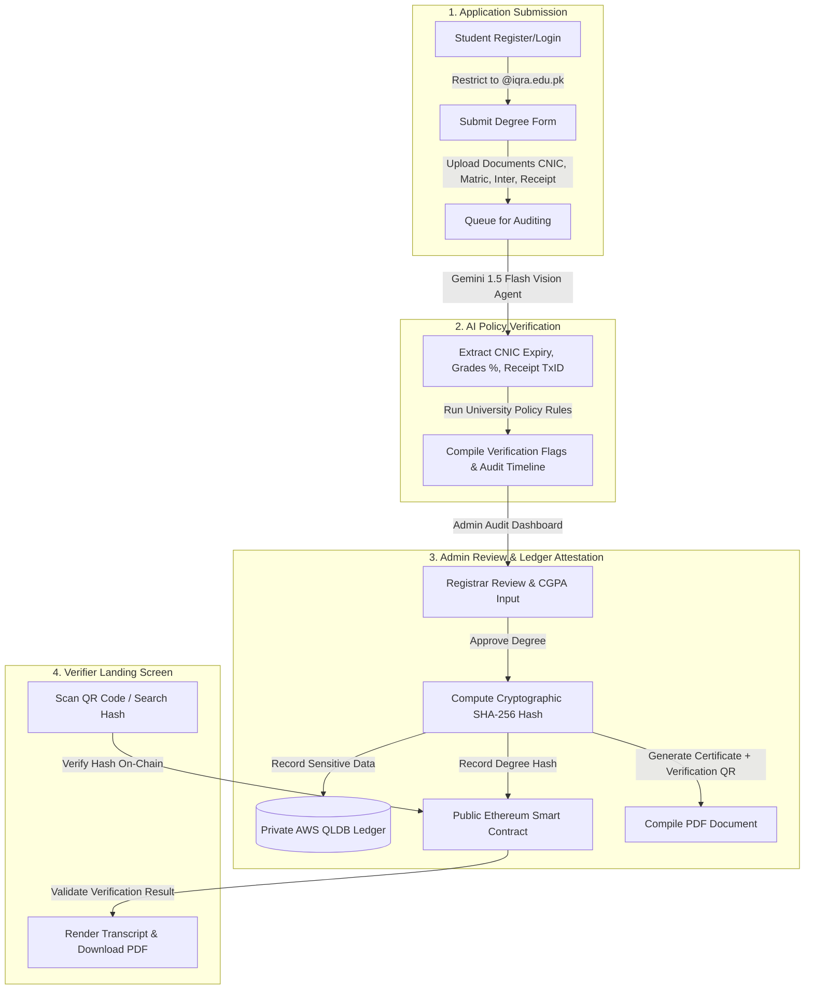

# 🎓 IQRA TrustLedger: Project Summary & Architecture Guide

This document provides a complete technical walkthrough and architectural analysis of the **IQRA TrustLedger: Hybrid Blockchain Degree Issuance & Verification System**. It describes the problem solved, the components implemented, and how the frontend, backend, smart contract, and AI modules interact.

---

## 🧭 System Overview

IQRA TrustLedger is a Web3 and AI-driven platform for automating academic credential verification, verifying matriculation/intermediate guidelines, checking payment receipts, and anchoring graduate credentials in a hybrid ledger model.

1. **AI Document Audit**: Uses **Gemini 1.5 Flash Vision** to perform Optical Character Recognition (OCR) on candidate documents (CNIC, Matric/Intermediate marksheets, and bank receipts) to enforce admission/graduation compliance checks.
2. **Hybrid Blockchain Architecture**:
   - **Private Ledger (AWS Managed Blockchain/QLDB simulation)**: Securely stores sensitive personal student information (CNIC details, Date of Birth, Roll Number).
   - **Public Ledger (Ethereum/Hardhat Solidity Smart Contract)**: Publishes a cryptographic SHA-256 hash of the degree record to ensure public, immutable verification without exposing private data.
3. **Automated Certificate Compiler**: Compiles beautiful landscape digital certificate PDFs with embedded QR codes leading to the verification portal.
4. **Public Verification Portal**: Allows employers or third parties to query on-chain verification hash proofs, rendering the graduate transcript in real-time.

---

## 🏗️ System Architecture & Data Flow

Below is the layout of the degree request, AI audit, registrar approval, ledger indexing, and verification lifecycle:



---

## 📂 Codebase & File Map

### Backend Structure (`/backend`)
*   [server.js](file:///c:/Users/dell/Downloads/Blockchain%20CCP/backend/server.js): Root server script bootstrapping Express middleware, static directories, database, and route mappings.
*   **config/**
    *   [db.js](file:///c:/Users/dell/Downloads/Blockchain%20CCP/backend/config/db.js): Sets up connection logic to the local or cloud MongoDB instances.
*   **models/**
    *   [user.js](file:///c:/Users/dell/Downloads/Blockchain%20CCP/backend/models/user.js): Schema defining students (restricted to domain validation) and administrative registrar accounts.
    *   [application.js](file:///c:/Users/dell/Downloads/Blockchain%20CCP/backend/models/application.js): Tracks uploaded document files, payment receipts, Gemini OCR output data, and policy flag status.
    *   [degree.js](file:///c:/Users/dell/Downloads/Blockchain%20CCP/backend/models/degree.js): Stores public degree details, SHA-256 hash, and transaction receipts mapping to private and public networks.
    *   [auditLog.js](file:///c:/Users/dell/Downloads/Blockchain%20CCP/backend/models/auditLog.js): Logs attestation execution times, query requests, and fraud logs.
*   **controllers/**
    *   [authController.js](file:///c:/Users/dell/Downloads/Blockchain%20CCP/backend/controllers/authController.js): Handles registration and JWT credentials.
    *   [applicationController.js](file:///c:/Users/dell/Downloads/Blockchain%20CCP/backend/controllers/applicationController.js): Handles student submissions and document uploads via Multer.
    *   [adminController.js](file:///c:/Users/dell/Downloads/Blockchain%20CCP/backend/controllers/adminController.js): Orchestrates Gemini OCR re-runs, application updates, and ledger issuances.
    *   [verificationController.js](file:///c:/Users/dell/Downloads/Blockchain%20CCP/backend/controllers/verificationController.js): Fetches database entries and queries local Ethereum contract via Ethers.js.
*   **services/**
    *   [ocrService.js](file:///c:/Users/dell/Downloads/Blockchain%20CCP/backend/services/ocrService.js): Interfaces with the **Google Generative AI SDK** (using `gemini-1.5-flash`) to parse images and run policy criteria audits.
    *   [blockchainService.js](file:///c:/Users/dell/Downloads/Blockchain%20CCP/backend/services/blockchainService.js): Generates degree hashes, simulates AWS QLDB insertions, and invokes contract actions on Ethereum.
    *   [pdfService.js](file:///c:/Users/dell/Downloads/Blockchain%20CCP/backend/services/pdfService.js): Compiles landscape certificate PDFs via `pdfkit` and draws custom headers, borders, signatures, and `qrcode` symbols.
*   **contracts/**
    *   [Degree_contract.sol](file:///c:/Users/dell/Downloads/Blockchain%20CCP/backend/contracts/Degree_contract.sol): Solidity smart contract managing university licensing, student registration, and cryptographic degree registries.
*   **blockchain/**
    *   [simulation_scenario.js](file:///c:/Users/dell/Downloads/Blockchain%20CCP/backend/blockchain/simulation_scenario.js): Simulates university authorizations, issues degrees, runs verification queries, and tests fraud prevention.
    *   [report_generator.js](file:///c:/Users/dell/Downloads/Blockchain%20CCP/backend/blockchain/report_generator.js): Measures latency timings and generates metrics.

### Frontend Structure (`/frontend`)
*   **src/pages/**
    *   [LoginRegister.jsx](file:///c:/Users/dell/Downloads/Blockchain%20CCP/frontend/src/pages/LoginRegister.jsx): Secure portal for student/admin authentication.
    *   [StudentDashboard.jsx](file:///c:/Users/dell/Downloads/Blockchain%20CCP/frontend/src/pages/StudentDashboard.jsx): Application workflow where students upload files, specify payment hashes, and download generated degrees.
    *   [AdminDashboard.jsx](file:///c:/Users/dell/Downloads/Blockchain%20CCP/frontend/src/pages/AdminDashboard.jsx): Registrar audit panel showing OCR timelines, policy checks, manual approvals, and system metrics.
    *   [VerifyDegree.jsx](file:///c:/Users/dell/Downloads/Blockchain%20CCP/frontend/src/pages/VerifyDegree.jsx): Verification interface verifying cryptographic proofs, rendering details, and displaying transaction IDs.

---

## 🛠️ Deeper Look at Core System Features

### 1. Smart Contract: Role-Based Attestation (`Degree_contract.sol`)
The Solidity contract deployed to our Ethereum network implements access control mapping and hash verification methods:
*   **Roles**:
    *   `admin`: The contract creator who can register universities, students, and employers.
    *   `authorizedUniversities`: Licensed higher-education addresses allowed to call `issueDegree`.
*   **State Maps**:
    *   `degrees`: Maps a degree's cryptographic SHA-256 hash to a `DegreeInfo` structure:
      ```solidity
      struct DegreeInfo {
          string degreeSerialNumber;
          string graduateName;
          string programName;
          uint256 graduationDate; // Unix Timestamp
          uint256 cgpa;           // Scaled by 100 (e.g., 385 represents 3.85)
          address university;
          bool isIssued;
      }
      ```
    *   `usedSerialNumbers`: Ensures a physical certificate serial number cannot be registered twice.
*   **Validation Functions**:
    *   `issueDegree(...)`: Only callable by authorized universities. Registers a new degree hash, locking the associated metadata to Ethereum.
    *   `verifyDegree(...)`: A read-only verification helper returning the degree record. If the hash is fake, the lookup reverts.

### 2. AI OCR Policy Engine (`ocrService.js`)
When a student uploads documents, the AI system parses files with `gemini-1.5-flash` using specialized validation templates:
*   **CNIC Parsing**: Extracts CNIC expiry date (`YYYY-MM-DD`).
*   **Academic Transcript Parsing**: Scans matriculation and intermediate board sheets to extract percentages. If only raw grades are found, the engine calculates the percentage (Obtained Marks / Total Marks).
*   **Payment Receipts**: Extracts the Payment Reference/Transaction Hash and the Amount Paid.
*   **Academic Guidelines Audited**:
    1.  **CNIC Expiry**: Expiry Date must be ahead of the current date.
    2.  **Matriculation Grades**: Must be $\ge 50\%$.
    3.  **Intermediate Grades**: Must be $\ge 50\%$.
    4.  **Payment Verification**: The extracted receipt transaction code and amount must match the payment parameters submitted in the student application form.

### 3. Verification PDF & QR Code Compiler (`pdfService.js`)
Once the registrar approves an application and issues the degree, the compiler generates a high-resolution PDF certificate:
*   **Dimensions**: A4 Landscape layout.
*   **Visual Assets**: Double-line borders (Navy-Slate + Amber-Gold) and formal signature lines for the Dean of Faculty and Registrar.
*   **Embedded QR Verification**: Integrates a custom QR code referencing the verification route (`/verify/HASH`) for quick mobile checks.
*   **Metadata Stamp**: Renders the unique serial number and on-chain verification hash at the bottom.

### 4. Interactive Auditing UI (Admin/Student Dashboards)
*   **Admin Dashboard**:
    *   **Live Metrics Engine**: Interactive glassmorphic stats cards detailing real-time numbers of issued degrees, verification queries, blocked fraud attempts, and system latency.
    *   **Audit Timelines**: Displays structured OCR checklists indicating whether the CNIC, Matric, Intermediate, and Payment logs passed university guidelines.
*   **Sun/Moon Theme Toggles**: A site-wide Light/Dark mode implementation matching state variables and persisting styles via `localStorage`.

---

## 🧪 Simulation, Testing & Sandboxing

The project provides a sandbox model for offline testing without requiring third-party credentials:

### A. Simulated OCR Sandbox
If `GEMINI_API_KEY` is not present, the system defaults to simulated deterministic responses. You can trigger different outcomes by naming files with special keywords:
*   **CNIC Expiry**: Include `expired` in the filename to trigger a CNIC policy rejection.
*   **Academic Grades**: Include `fail` or `low` in matric/intermediate marksheet uploads to trigger an academic rejection.
*   **Payment Receipts**: Include `mismatch` in receipt uploads to trigger a transaction verification failure.

### B. Blockchain Simulation Scenario (`simulation_scenario.js`)
To run a command-line simulation of the smart contract lifecycle:
1. Compile the Solidity code:
   ```bash
   npx hardhat compile
   ```
2. Start the local private Ethereum blockchain node:
   ```bash
   npx hardhat node
   ```
3. Run the automated seed and simulation script:
   ```bash
   node blockchain/simulation_scenario.js
   ```
   This simulation performs the following automated actions:
   * Deploys `DegreeContract` to the local network.
   * Registers University, Student, and Employer roles.
   * Attests and registers exactly **5 simulated digital degrees** on the blockchain and MongoDB.
   * Executes **3 successful verification queries** on behalf of employers.
   * Simulates a **tampered degree lookup** (detects modifications in CGPA) and logs a blocked fraud attempt.
   * Simulates an **unauthorized attestation attempt** by an unregistered address, showing how the smart contract reverts unauthorized transactions.
   * Generates a performance report listing database totals and average execution times.

---

## 🔗 Project Routing Map

### Backend Endpoints
*   `POST /api/auth/register`: Signup restricted to university domains.
*   `POST /api/auth/login`: Logs user in and signs JWT.
*   `GET /api/applications`: Lists applications submitted by the logged-in student.
*   `POST /api/applications/apply`: Submits application details and uploads files using Multer middleware.
*   `GET /api/admin/applications`: Admin-only view to review all student files in the system queue.
*   `POST /api/admin/applications/:id/ocr`: Manually invokes the Gemini OCR model to recheck file guidelines.
*   `POST /api/admin/applications/:id/approve`: Commits student metadata to the hybrid ledger, builds the PDF certificate, and changes application status to `approved`.
*   `POST /api/admin/applications/:id/reject`: Rejects application and logs the reason.
*   `GET /api/admin/metrics`: Aggregates audit counts and execution times.
*   `GET /api/verify/:hash`: Public verification portal lookup endpoint.

---

## 📈 System Metrics & Security Audit Summary

| Component | Target Parameter | Mitigation / Protection Strategy |
| :--- | :--- | :--- |
| **Academic Authentication** | Domain Restriction | Restricts registrations to `@iqra.edu.pk` to block external accounts. |
| **Document Processing** | Fraudulent Uploads | Background Gemini 1.5 Flash vision agent checks and compares grades and payment hashes. |
| **Private Data Storage** | Leakage of Student DOB/CNIC | Sensitive attributes are isolated inside a private datastore. |
| **On-Chain Attestation** | Counterfeit Certificates | Only a SHA-256 cryptographic hash of the degree metadata is published to the public blockchain registry. |
| **Attester Authorization** | Rogue Registries | `onlyUniversity` modifier prevents unauthorized nodes from signing or issuing credentials. |
| **Certificate Verification** | QR Spoofing | QR code links to an absolute, blockchain-backed verification portal that verifies hashes directly on the public contract. |
