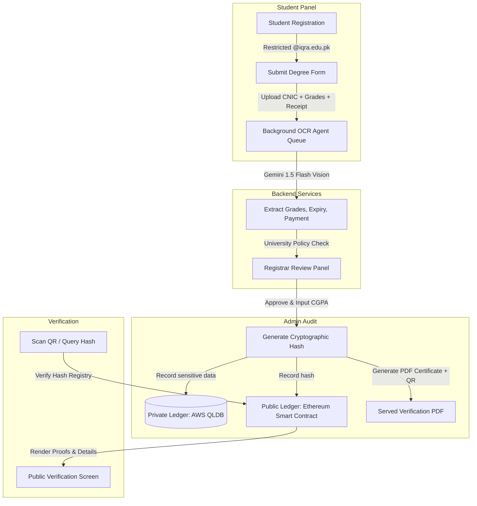

# 🎓 IQRA TrustLedger: Hybrid Blockchain Degree Issuance & Verification System

[](https://opensource.org/licenses/MIT)
[](https://nodejs.org/)
[](https://react.dev/)
[](https://www.mongodb.com/)
[](https://deepmind.google/technologies/gemini/)

A premium, state-of-the-art Web3 and AI-driven degree auditing, issuance, and verification platform. The application automates student document review using a Gemini OCR vision agent and anchors degree validity securely using a hybrid blockchain approach (Private AWS Ledger Store + Public Ethereum Hash Registry).

---

## 🌟 Key Features

*   **Restricted Academic Authentication:** Secure user signup and login restricted exclusively to `@iqra.edu.pk` email domains.
*   **AI-Driven OCR Audit Agent:** Automatic background extraction of CNIC expiry, matriculation/intermediate percentages, and payment transaction receipts using **Gemini 1.5 Flash**.
*   **Academic Policy Engine:** Hardcoded university guidelines audit check:
    *   Matriculation grades $\ge 50\%$
    *   Intermediate grades $\ge 50\%$
    *   Unexpired CNIC validation check
    *   Payment transaction matching check (amount and reference hash)
*   **Hybrid Blockchain Ledger Model:**
    *   **Private Ledger:** Sensitive graduate credentials stored securely inside a private AWS Managed Ledger environment (simulated via secure service).
    *   **Public Verification:** Degree cryptographic hash published to a public Ethereum smart contract for unalterable verifications.
*   **Dynamic Certificate Compilation:** Automatic creation of high-fidelity landscape degree PDFs embedding a cryptographic verification QR code.
*   **Public Verification Portal:** Scan-to-verify landing page that queries public ledgers, performs match checks, and visualizes the verified transcript.
*   **Premium Glassmorphic Interface:** A modern, white-themed layout styled with Outfit/Jakarta typography, micro-interactions, responsive form sheets, and audit timelines.

---

## 🏗️ Architecture & System Design



---

## 📂 Repository Structure

```
Hybrid-Blockchain-Degree-Issuance-Verification/
├── backend/
│   ├── config/             # Database connection setup
│   ├── controllers/        # Controllers (Auth, Applications, Admin, Verify)
│   ├── middleware/         # Auth filters & Multer storage configuration
│   ├── models/             # Mongoose Schemas (User, Application, Degree)
│   ├── routes/             # API Router endpoints
│   ├── services/           # Services (OCR Agent, Blockchain Ledger, PDF/QR Compile)
│   ├── uploads/            # Temporary file upload destination (ignored by Git)
│   ├── server.js           # Server starter file
│   └── package.json
└── frontend/
    ├── src/
    │   ├── assets/         # App icons & layout graphics
    │   ├── components/     # UI shared elements
    │   ├── context/        # Global AuthState provider
    │   ├── pages/          # LoginRegister, StudentDashboard, AdminDashboard, VerifyDegree
    │   ├── services/       # Fetch API client wrapper
    │   ├── App.jsx         # Routes manager
    │   ├── index.css       # Custom design system configuration (White Theme)
    │   └── main.jsx
    └── package.json
```

---

## 🛠️ Installation & Setup

### Prerequisites
*   Node.js (v16+)
*   MongoDB installed and running at `mongodb://localhost:27017`

### 1. Setup Backend
1.  Navigate into `/backend`:
    ```bash
    cd backend
    ```
2.  Install dependencies:
    ```bash
    npm install
    ```
3.  Configure environment keys in `backend/.env`:
    ```env
    PORT=5000
    MONGO_URI=mongodb://localhost:27017/blockchain_degree_db
    JWT_SECRET=supersecretkey123
    FRONTEND_URL=http://localhost:5173
    GEMINI_API_KEY=your_gemini_api_key_here
    ```
4.  Run the development server:
    ```bash
    npm run dev
    ```

### 3. Blockchain Setup & CLI Simulation
1. Compile the Solidity smart contracts:
   ```bash
   npx hardhat compile
   ```
2. Start the local private Ethereum blockchain network node (keep this terminal running):
   ```bash
   npx hardhat node
   ```
3. Open a separate terminal and run the automated seed and test simulation script:
   ```bash
   node blockchain/simulation_scenario.js
   ```
   *(This script will deploy the contract, register University, Student, and Employer roles on-chain, issue 5 digital degrees, run 3 verification queries, simulate 2 fraud attempts, and print a performance metrics summary).*

### 4. Setup Frontend
1.  Navigate into `/frontend`:
    ```bash
    cd frontend
    ```
2.  Install dependencies:
    ```bash
    npm install
    ```
3.  Run the React client:
    ```bash
    npm run dev
    ```
4.  Open `http://localhost:5173` in your browser.

---

## 🧪 Testing Guidelines (Mock Sandbox)

If a `GEMINI_API_KEY` is not present, the system activates a deterministic **Simulated OCR Agent**. You can test full academic policy validations by naming your upload files with specific tags:

*   **CNIC Expiry Check:** Name front CNIC image with `expired` in filename (e.g., `cnic_expired.jpg`) to trigger a **CNIC Expiry** rejection.
*   **Grade Threshold Check:** Name matric/inter marksheets with `fail` or `low` in filename (e.g., `inter_fail.jpg`) to trigger a **Grades below 50%** rejection.
*   **Payment Discrepancy Check:** Name receipt image with `mismatch` in filename (e.g., `receipt_mismatch.jpg`) to trigger a **Payment verification mismatch** rejection.

### Test User Accounts:
*   **Student Account:** Register under any email (e.g., `student@iqra.edu.pk`).
*   **Admin Registrar Account:** Register under an email starting with the word `admin` (e.g., `admin@iqra.edu.pk`) to bypass standard checks and access the auditing dashboard queue.

---

## 🚀 Recent Upgrades
*   **Dual Theme Support (Light/Dark Mode)**: Added a premium Sun/Moon switcher on all views (guest and authenticated) with body theme toggling and localStorage persistence.
*   **Live Metrics Engine**: Interactive glassmorphic stats cards reporting real-time totals, verification queries, fraud attempts, and latency.
*   **Robust Access & Downloads**: Fixed student PDF retrieval to pull directly from the DB Degree mappings, avoiding unauthorized endpoints.

---

## 📄 License

This project is licensed under the MIT License - see the [LICENSE](LICENSE) file for details.
